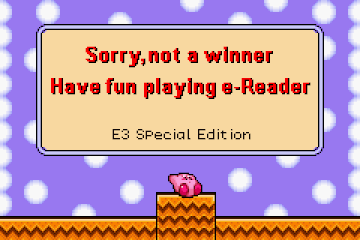

# Kirby Contest Card - Loser




## How to build

* Download [SDCC](http://sdcc.sourceforge.net/)
* Download e-reader tools from [caitsith2.com](https://www.caitsith2.com/ereader/index.htm)

Compile:
```
sdasz80.exe -l -o -s -p main.o main.asm
```

Link:
```
sdldz80.exe -n -- -i main.ihx main.o
```

Make binary:
```
makebin.exe -p < main.ihx > main.z80
```

Remove first 256 bytes of `main.z80`.

Generate `RAW`:
```
nedcmake.exe -i main.bin -o us -type 1 -region 1
```

## Assets

### Background


### Sprites

